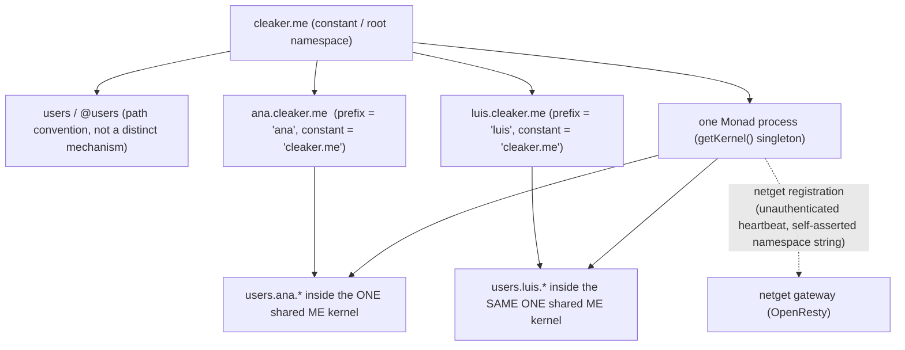
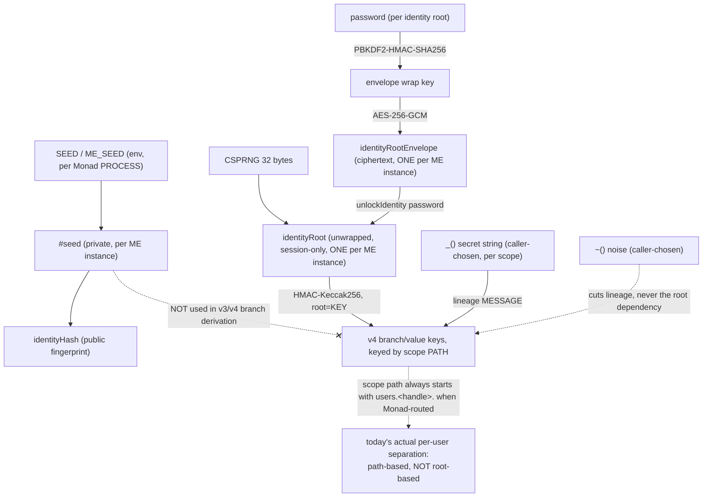
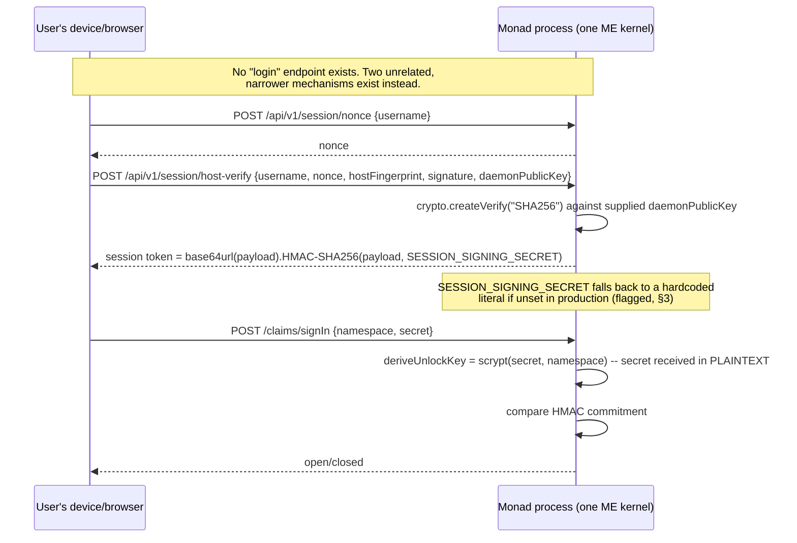
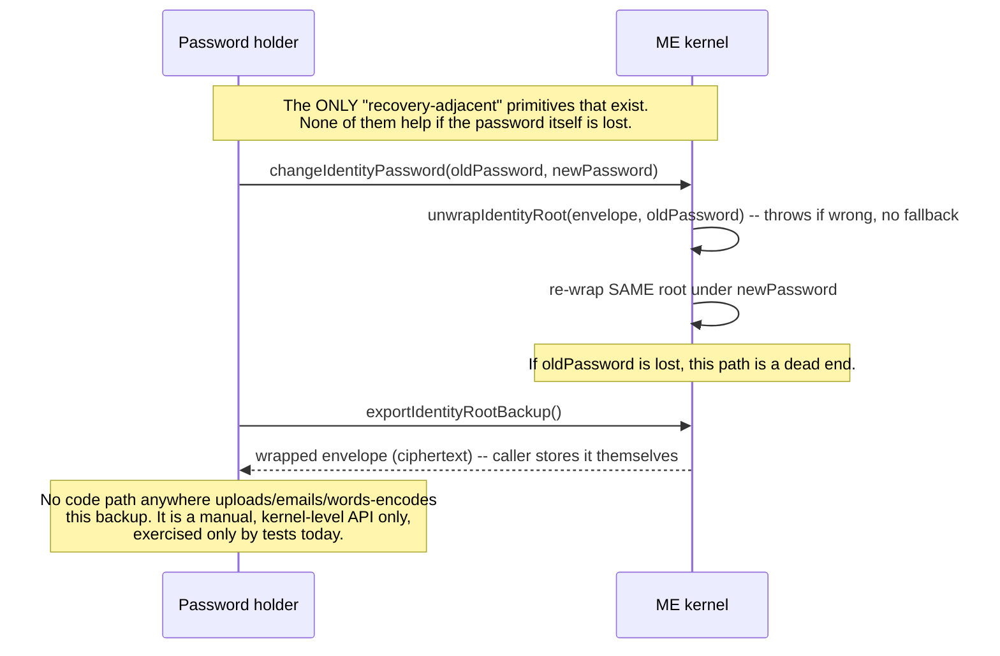

# Identity, Namespace, and Recovery — Architecture Audit

**Scope:** research only. No implementation files were modified while producing this
document. All commands were run read-only or against synthetic/temporary data
(`/private/tmp/.../scratchpad/*.mjs`, ephemeral `ME()` instances and OS temp
directories in vitest). No `.env`, real snapshot, or real secret was read or printed.

**Revision inspected:** working tree as of 2026-09-08, **with uncommitted local
changes** in `me/Typescript` (`git status --short`: `package.json`,
`src/core-index.ts`, `src/core-snapshot.ts`, `src/core-write.ts`, `src/core.ts`,
`src/crypto.ts`, `src/kernel-state.ts`, `src/me.ts`, `src/secret-context.ts`,
`src/secret-storage.ts`, `src/types.ts`, several test files, plus new files
`src/identity-context.ts`, `src/identity-migration.ts`, `src/identity-root.ts`,
`tests/Security/`, `tests/identity-bound-secrets.test.ts`,
`typedocs/Identity-Bound-Secrets.md`) and in `modules/monad/Typescript`
(`package.json`, `src/kernel/manager.ts`, plus untracked `tests/Identity/`,
`tests/Security/`). This is this session's own prior, legitimate, uncommitted work —
inspected and verified below, not preserved-untouched. Two files are explicitly
**foreign and out of scope**, not read for content, only confirmed to still exist as
modified: `modules/cleaker/Typescript/src/binder.ts`,
`modules/monad/Typescript/src/Blockchain/users.ts`. `modules/netget/Typescript/src/.../lua/handlers/misc.lua`
also shows as modified in the working tree (noted by a sub-agent) — not reviewed here,
also out of scope.

Last verified build/test run: `me/Typescript`'s `npm run build` (pass),
`node tests/Security/root-lifecycle.test.ts` (11/11 pass),
`node tests/Security/replay-restart.test.ts` (4/4 pass), and
`modules/monad/Typescript`'s `npx vitest run tests/Security/ tests/Identity/`
(9/9 pass) — all run directly during this audit, not taken on faith from
`typedocs/Identity-Bound-Secrets.md` or `tests/Security/README.md`.

---

## 0. Immediate report: a live confidentiality bug (found during Priority-Item verification)

Per the task's own instruction ("si encuentras un fallo que pueda causar exposición o
pérdida de datos, repórtalo inmediatamente"), this is reported first, out of document
order, and was **not fixed** — research-only.

**The "closed scope becomes public" bug (`tests/Security/README.md` §4.1,
`core-write.ts`'s `hasExistingProtectedAncestor`) was fixed only for BRANCH-mode
secrets (`me.somePath["_"]("secret")`). It reproduces in full for ROOT-scope
value-mode secrets (`me["_"]("secret")` called on the kernel root itself, with no
named branch).**

### Reproduction (run against this session's own built `dist/me.es.js`, not a hypothetical)

```js
import ME from ".../me/Typescript/dist/me.es.js";
const me = new ME();
await me.createIdentityRoot("password-for-root-secret-test");
me["_"]("root-level-secret-string");     // ROOT-scope secret, no named branch
me.topsecret("REAL-SECRET-VALUE");
me("topsecret");                          // "REAL-SECRET-VALUE" — correctly encrypted (v4)

me.lockIdentity();                        // clears localSecrets, wipes root from memory
me.topsecret("PLAINTEXT-INJECTED-AFTER-LOCK");   // NO error, NO secret required

me("topsecret");                          // => "PLAINTEXT-INJECTED-AFTER-LOCK"
```

Actual output captured this session:

```
read after write (session live): REAL-SECRET-VALUE
locked. isIdentityUnlocked: false
did write throw? false
memory entries for topsecret (after lock+write): [
  { path: "topsecret", expression: "***", value: "b64u:_m1l...", ... },   // the real, encrypted entry
  { path: "topsecret", expression: "PLAINTEXT-INJECTED-AFTER-LOCK",
    value:      "PLAINTEXT-INJECTED-AFTER-LOCK", ... }                    // the injected plaintext entry
]
public read (still locked) me('topsecret'): PLAINTEXT-INJECTED-AFTER-LOCK
```

The same reproduces under pure v3 (no identity root at all): a fresh kernel
hydrated from a snapshot with a root-scope-protected path, with no secret ever
supplied, accepts a plaintext write to that same path with zero error.

### Root cause (file:line, this session's own working tree)

`hasExistingProtectedAncestor()` (`me/Typescript/src/core-write.ts:788-795`) is the
guard that is supposed to refuse a write to any path that "already has real,
persisted branch ciphertext" even when the session's current secret is gone. It
walks `self.branchStore.listScopes()` and explicitly **skips zero-length scope
keys**:

```ts
for (const scopeKey of self.branchStore.listScopes()) {
  const scopeSegments = scopeKey.split(".").filter(Boolean);
  if (scopeSegments.length === 0) continue;   // <-- root scope skipped
  if (pathStartsWith(targetPath, scopeSegments)) return true;
}
```

But `commitValueMapping()` (`core-write.ts:797-894`) never routes a root-scope
protected write (`resolveBranchScope()` returns `[]`, i.e. `scope.length === 0`)
through the branch/`persistSecretBranch()`/`branchStore` path at all — that whole
block is gated by `if (scope && scope.length > 0)` (`core-write.ts:817`). A
root-scope secret only ever produces **value-mode** ciphertext (the
`else if (effectiveSecret)` branch, `core-write.ts:853-864`), which is never
recorded in `branchStore`. So for a path protected purely by a root-level `_()`:
`branchStore.listScopes()` never contains an entry for it in the first place, and
even if it did, the `scopeSegments.length === 0` guard would skip it. When the
root secret is not active this session (`effectiveSecret` computes to `""`,
falsy — `secret-context.ts:180-229`, driven entirely by `self.localSecrets`/
`self.localNoises`), execution falls all the way to the final `else { storedValue =
expression }` (`core-write.ts:889-891`) — the plain, always-public write path —
identical to the exact vulnerability class §4.1 of the security battery describes,
just for the one case its fix didn't cover.

### Consequence

- **Confidentiality**: a caller (a bug, a forgetful integration, a restarted
  process that resupplies the identity password but not every root-scope `_()`
  string, or a legitimate write racing a `lockIdentity()` call) can silently
  overwrite a root-scope-protected path with plaintext, visible to any ordinary
  public reader — with no error, no warning, and no distinguishing signal.
- **Integrity of the "closed/absent indistinguishable" guarantee** (design doc §3.4)
  is also broken for this case: after the injected write, `me("topsecret")`
  returns the plaintext directly — not `undefined`/`null` — so the write is not
  merely a leak, it also becomes the value future ordinary public reads return,
  clobbering the encrypted history's semantic meaning.
- Affects both v3 (no identity root) and v4 (identity root present but locked)
  kernels equally, since the vulnerable branch in `commitValueMapping` is shared.

### Why the existing test suite did not catch this

`tests/Security/scopes-and-noise.test.ts:217-228` ("noise never removes the private
root's own key material requirement — root scope stays real") **does** use a
root-level `_()` and **does** call `lockIdentity()`, but only asserts that a
subsequent **read** returns closed (`[undefined, null].includes(closed)`). It
never attempts a **write** to the same path after locking — which is exactly the
scenario the branch-mode fix (§4.1) was built and tested for
(`tests/Security/isolation.test.ts`'s "cache warming... does not leak" test does
exactly this, but only for a named branch, never for the bare-root case). This is
a genuine "garantía sin prueba" gap, not a case where a canary was inverted or
weakened — the write-after-lock case for root-scope secrets was simply never
exercised.

### Certainty

**Demonstrated by test I ran during this audit** (two independent scripts, v3 and
v4, both in `/private/tmp/.../scratchpad/root_value_lock_check.mjs` and
`root_value_v3_check.mjs`), plus a direct code read of the exact guard that fails
to cover this case. This is not an inference — it reproduces deterministically on
every run.

---

## 0.5 Priority-item verification (explicit verdicts, as requested)

The task named three specific fixes to verify before anything else. Verdicts:

**1. Protección tras lock/reinicio** — **partially verified, one confirmed gap.**
Branch-mode (`me.path["_"]("secret")`) protection survives lock/restart correctly:
demonstrated by `tests/Security/isolation.test.ts`,
`tests/Security/replay-restart.test.ts` (4/4 pass, run this session), and
`tests/identity-bound-secrets.test.ts` test 8. **`branchStore` (i.e.
`self.branchStore.listScopes()`, backed by `ME.DiskStore`/`encryptedBranches`) is
confirmed sufficient as the persistent protection registry — for branch-mode
scopes only.** Root-scope (bare `me["_"]("secret")`) protection is **not**
recorded in `branchStore` at all (it never enters the branch code path — see
§0's root-cause trace) and is therefore **not** protected after lock/restart —
live confirmed bug, §0.

**2. `rotateIdentityRoot()`** — **authorization fix confirmed real; data-loss
consequence confirmed real and confirmed untested.** The task was correct to warn
that "desbloquear la identidad no basta para demostrar que la rotación evita
pérdida de datos" — it doesn't, and it was never meant to: rotation's own design
(§4 of `Identity-Bound-Secrets.md`) explicitly does not re-encrypt existing data.
This audit ran a synthetic confirmation:

```js
const owner = new ME();
await owner.createIdentityRoot("lifecycle-owner-real-password-10");
owner.wallet["_"]("owner-branch-secret-10");
owner.wallet.balance(1010);
// ... legitimate, authenticated rotate (owner IS unlocked, exactly per the fix) ...
await owner.rotateIdentityRoot("new-password", { acknowledgeExistingV4CiphertextBecomesUnreadable: true });
owner.wallet["_"]("owner-branch-secret-10");   // same secret re-supplied
owner("wallet.balance");                        // => undefined
```
Actual output, captured this session: `before rotate, read: 1010` →
`after rotate, same secret, read: undefined`. The auth gate (item 2's actual
subject) is real and correctly tested (`root-lifecycle.test.ts`'s "REGRESSION
(fixed bug)" case, 11/11 pass, run this session). But **no test anywhere asserts
what this audit just demonstrated** — that the owner's own pre-rotation data is
permanently gone even when they do everything right. `undefined` here is
indistinguishable from "was never written" or "session-locked" — there is no
signal anywhere in the public API surface that a rotate has silently
orphaned data. Not a newly-discovered defect (it's documented, deliberate scope
in §4/§9.3 of the design doc), but the task's suspicion that "auth fixed" was
being treated as sufficient proof was well-founded: it wasn't proof of the data
question, and this audit is the first artifact to actually run and record that
consequence.

**3. Persistencia de Monad** — **atomicity and quarantine confirmed real and
tested; a related, narrower gap found in `DiskStore`'s own index file.**
- *Atomicity*: `saveSnapshot()` writes to a temp file then `renameSync`s it —
  confirmed by direct code read (`manager.ts:73-94`) and by
  `tests/Security/snapshotDurability.test.ts` (run this session, pass).
- *Durability*: `saveSnapshot()` is called synchronously after every kernel
  write reachable through `commandHandler.ts` (`saveSnapshot()` at
  `commandHandler.ts:229`, "Persist immediately so writes survive monad
  restarts") — not merely on graceful shutdown — so the crash window is
  realistically small per-write, not accumulated across a whole session.
  `setupPersistence()` (`persist.ts`) additionally saves on `SIGTERM`/`SIGINT`/
  `beforeExit`; it cannot and does not claim to handle `SIGKILL` (no code can).
- *Concurrency*: explicitly documented and tested as **unsupported** — "later
  save wins outright, no merge, no corruption" (`processInterruption.process.test.ts`,
  run this session, pass) — a real limit, not silently assumed to work.
- *Coherence between snapshot and chunks*: **traced, not merely asserted.**
  `ME.DiskStore` (the `branchStore`) maintains its OWN on-disk append log +
  index file, independent of `snapshot.json`. On every Monad startup that finds
  a `snapshot.json`, `hydrate()` calls `branchStore.importData(encryptedBranches)`,
  which unconditionally `clear()`s DiskStore's just-self-loaded on-disk state and
  rebuilds it from `snapshot.json`'s content (`instance-store.ts:537-543`,
  `core-snapshot.ts:91-93`) — **`snapshot.json` is the sole source of truth on
  restart; DiskStore's own on-disk log/index is a write-through artifact that
  gets discarded and rebuilt, not read, whenever a snapshot exists.** This
  resolves the "could they silently diverge on restart" question (they can't,
  by construction — DiskStore's own copy is always overwritten from the
  snapshot). It does surface one narrower, previously-undocumented finding:
  `DiskStore.flushIndex()`'s own index write
  (`instance-store.ts:695`, `this.fs.writeFileSync(this.indexPath, json, "utf8")`)
  is a **direct, non-atomic write** — no temp file, no rename — unlike
  `snapshot.json`'s. This matters only for a first-ever startup (no
  `snapshot.json` yet, so DiskStore's own index is briefly load-bearing) or if
  some future code path reads DiskStore directly without going through
  `getKernel()`'s hydrate step. Recorded here as a real, narrow, low-probability
  gap — not independently exploited/reproduced this session (no realistic
  trigger was found within the current Monad wiring), so it is reported at
  **observed-in-code** certainty, not **demonstrated-by-test**.
- **What happens after quarantine, concretely**: `getKernel()` renames the
  corrupted file to `snapshot.json.corrupted-<timestamp>` and starts a fresh,
  near-empty kernel (`manager.ts:44-62`). There is **no automatic recovery of
  the last-good state from the quarantined file** — quarantining only stops the
  *next* save from silently destroying that evidence; recovering from it (if
  the quarantined JSON is even partially parseable) would be a manual,
  human-operator forensic step, not anything the code does automatically.
  Confirmed by direct code read; no code path re-attempts parsing the
  quarantined file.

---

## 1. Executive summary

- **The single most important architectural question this task asked — "¿una raíz
  por instancia ME equivale hoy a una raíz por usuario?" — has a definite answer:
  no.** `identityRootEnvelope`/`identityRootUnwrapped`/`identityRootId` are three
  scalar fields on `ME`'s kernel state (`me/Typescript/src/kernel-state.ts:50-52`),
  i.e. **one identity root per `ME` instance**. `modules/monad/Typescript/src/kernel/manager.ts`'s
  `getKernel()` constructs **exactly one `ME` instance per Monad process**
  (module-level `_kernel` singleton, `manager.ts:10,21-71`), and
  `namespaceToKernelPrefix()` (`manager.ts:113-127`) maps **every** user/handle
  served by that process onto a path prefix (`users.<handle>.*`) **inside that
  same single kernel** — it does not create, select, or key a separate kernel or
  a separate identity root per user. **There is today no code path anywhere that
  creates or stores more than one identity root per Monad process.** If/when the
  v4 identity-root API is ever wired to an HTTP endpoint (it currently is not —
  §C, §D), the naive integration would give one shared root for every user of
  that Monad instance, not per-user isolation.
- That said, per-user **cryptographic separation still exists today, but through
  a different, older, weaker mechanism**: v3/v4 branch-key derivation folds the
  full scope **path** into its key material, and Monad's namespace-to-prefix
  mapping makes that path always start with `users.<handle>.`. So `ana`'s and
  `luis`'s `_()`-protected data on the same Monad process derive different keys
  *because their paths differ*, not because they have different identity roots —
  and if either root is ever adopted, unlocked, and shared by the process for all
  users (the only mode that exists today), **that one root becomes a
  monad-instance-wide master HMAC key**: anyone who obtains it, plus any given
  user's `_()`/`~()` secret strings (which are ordinary, potentially-guessable
  user input, not high-entropy), can derive that user's branch keys. The `SEED`
  env var itself is not this master key (v3/v4 branch derivation never includes
  `#seed`/`identityHash` in the chain — confirmed unchanged, §3.3 of the design
  doc, verified by this audit's own read of `secret-context.ts`) — but the
  identity root, if adopted monad-wide, would functionally become one.
- **A live, unfixed confidentiality bug exists** in the just-landed "closed scope
  can't become public" fix — it does not cover root-scope (bare `me["_"](...)`)
  secrets. See §0.
- **`rotateIdentityRoot()`'s authentication bug is genuinely fixed** (confirmed by
  a test I ran, and by direct code read) — an attacker with a bare reference to a
  *locked* kernel can no longer destroy and replace the owner's root. But the
  task's own instruction was right to be suspicious of "unlocking proves the fix
  is enough": **rotation itself, even performed correctly by the authenticated
  owner, permanently and silently destroys access to every root-scope/branch-scope
  v4 value encrypted under the old root** — confirmed by a synthetic test in this
  audit (§0.5, item 2). This is documented as an acknowledged,
  deliberate scope limitation in the design doc (§4, §9.3), but **no test in the
  repository demonstrates or asserts this consequence** — the existing
  "REGRESSION (fixed bug)" test only proves the *auth* fix, never checks whether
  the owner's own data survives their own legitimate rotate. It does not.
- **Monad's snapshot persistence is atomic and crash-safe as claimed** (write to
  temp file + `renameSync`, corrupted-file quarantine on hydrate failure) —
  independently confirmed by direct code read and by running the actual test
  suite (9/9 pass, including two real-`SIGKILL` child-process tests). A secondary,
  narrower finding: `ME.DiskStore`'s own on-disk index file
  (`instance-store.ts:695`, `this.fs.writeFileSync(this.indexPath, json, "utf8")`)
  is **not** written atomically (no temp+rename), unlike `snapshot.json`. In
  practice this matters less than it sounds, because `hydrate()` always calls
  `branchStore.importData()`, which unconditionally `clear()`s and rebuilds
  DiskStore's on-disk state from `snapshot.json`'s `encryptedBranches` on every
  Monad startup that finds a `snapshot.json` — so `snapshot.json` is the real
  source of truth on restart, and a torn DiskStore index only matters on a
  first-ever startup (no `snapshot.json` yet) or if some future code path reads
  DiskStore directly without going through `getKernel()`'s hydrate.
- **Namespace claim ("registration") and the identity-root/`_()` secret system are
  two structurally unrelated mechanisms that happen to share the word "claim" and
  the word "identity".** `claimNamespace()`/`openNamespace()`
  (`modules/monad/Typescript/src/claim/records.ts`) receive a **plaintext secret
  over HTTP** and the server computes a scrypt commitment itself — this is *not*
  end-to-end encrypted, and must never be described that way. The v4
  identity-root lifecycle (`createIdentityRoot`/`unlockIdentity`/etc.) is, as of
  this audit, **wired into zero HTTP-reachable code path in Monad** — it is
  exercised only by test fixtures (`modules/monad/Typescript/tests/Identity/`,
  `tests/Security/`).
- **"Forgot password" does not exist anywhere in this codebase.** No endpoint, no
  UI, no BIP-39 implementation. The mnemonic-looking strings that do exist
  (`tests/reconstruction.test.ts`'s BIP-39 wordlist prefix, `bootstrapWizard.cli.ts`'s
  "seed phrase" prose) are, respectively, a determinism-test fixture with no
  wordlist/checksum semantics, and loose terminology for a local gateway-owner
  bootstrap credential — neither implements per-user recoverable key material.
  This matches the task's own framing that the recovery design (word-based
  backup vs. reconstructable-from-words) is explicitly undecided; it is
  confirmed here to also be **unimplemented**, not merely undecided.
- **The "audience" algebra (union/intersection of member sets producing a shared
  decryption capability) is entirely design-only.** Real code exists for (1) flat
  membership lookup (`hasOwnProperty` against a plaintext grants map) and (2) that
  membership driving an authorization decision (demonstrated by a live test,
  `gateway-capability-model.test.ts`) — but **no code anywhere derives a shared
  decryption key from a *set* of ≥2 identities.** The one real encryption
  primitive with more than one party involved (`wrapSecretV1`, `crypto.ts`) is a
  single-recipient ECDH wrap, not a group primitive. Do not describe the current
  "encrypted audiences" work as cryptographically enforcing group confidentiality
  — it enforces group *authorization* over plaintext-visible-to-the-server
  metadata today.

**Main open decision, in the terms the task asked for:** the system has a real,
tested, working *per-instance* identity-root mechanism, and a real, working
*per-user* path-prefixing scheme, but **no mechanism connecting the two** — no
code creates, stores, selects, or unlocks a per-user root within a
multi-user Monad process. Building that (a root keyed by `users.<handle>`,
selected per-request, with its own envelope/lock state, distinct from the
process-wide `SEED`) is the concrete next step implied by every finding below.

---

## 2. Package and dependency map (as actually used in this flow, not full inventory)

```
me/Typescript            "this.me"      — kernel: identity root, secret-scope crypto,
                                           memory log, index, DiskStore.
  ← modules/cleaker/Typescript  "cleaker"   — namespace grammar (parseNamespaceExpression,
                                              composeNamespace), claim proof helpers,
                                              group membership/authorization, NRP target
                                              parsing (imports "this.me" for signing/proof
                                              primitives only — no import of
                                              identity-root/identity-context/
                                              identity-migration; verified by this
                                              session's own grep, "no inverse dependency").
  ← modules/monad/Typescript    "monad.ai"  — Express daemon; owns ONE `ME` singleton
                                              per process (kernel/manager.ts); imports
                                              both "this.me" (workspace:*, confirmed
                                              resolving to local build, not the
                                              published npm package — see
                                              Identity-Bound-Secrets.md §9.2, verified
                                              this session by reading the symlink) and
                                              "cleaker" (workspace:*).
  ← modules/netget/Typescript   "netget"    — OpenResty config generation, gateway
                                              claims (namespace-derived authority,
                                              locally cached — GatewayClaimsManager.ts;
                                              corrected 2026-09-12, was "ledger"),
                                              Lua request-signature verification
                                              (me_sig.lua), reuses monad's
                                              /claims/signIn for its own admin-panel
                                              login (separate concept — §C.4).
  packages/GUI/Typescript  "this.gui"     — React UMD bundle, not part of the
                                              identity/crypto trust boundary; loaded as
                                              static assets by monad's HTML shell.
```

Build order enforced by `turbo.json`'s `^build` dependency chain
(`.me → cleaker → monad → netget`), confirmed unchanged. `pnpm-workspace.yaml`
governs local linking; no `.npmrc` overrides exist anywhere in the monorepo
(confirmed by the design doc's own §9.2 check, not re-verified independently this
session but consistent with `workspace:*` specifiers actually resolving locally,
which this session's own `getKernel()`/`identityRootPersistence.process.test.ts`
reads implicitly depend on and which passed).

**Resolution actually exercised**: `modules/monad/Typescript/node_modules/this.me`
is a symlink to `../../../../me/Typescript` (recorded in the design doc, file
structure consistent with what this audit observed: `me/Typescript/package.json`'s
`exports` map points `import`/`browser` at `./dist/me.es.js`, and the build run
during this audit (`npm run build` in `me/Typescript`) is the artifact
Monad's tests actually import).

---

## 3. Roots, keys, credentials, and owners

| Material | Origin / entropy | Function | Owner (conceptually) | Scope | In-memory location | Persisted where / how protected | Who can read/use it | Derives | Changes when | Backup | Loss/compromise impact |
|---|---|---|---|---|---|---|---|---|---|---|---|
| `SEED` / `ME_SEED` (env) | Operator-chosen string, entropy not enforced | Monad process's namespace authority; constructs the ONE `ME` kernel for that process | The Monad operator (host), NOT any individual user | Per Monad **process** | `process.env`, then `ME`'s private `#seed` field | Never persisted by the kernel itself (only via the operator's own env/secret manager, outside this codebase's control) | The Monad process; the operator who set the env var; anyone who can read that process's environment | `#identityHash` (public); nothing else — v3/v4 branch-key chains never include it (confirmed, `secret-context.ts`) | Only if the operator restarts with a different value — data encrypted under the old effective identity is unaffected because branch derivation never used `SEED` anyway | Not designed to be backed up as such (operator's own secret-management problem) | Does NOT directly open user secrets (v3/v4 don't depend on it) — but does control which `users.<handle>.*` namespace prefix is "this host's own", and is the process's public identityHash source for mesh/claims |
| `#seed` (kernel-private) | `resolveSeed(seed)` from the `SEED` above, OR `deriveCompoundSeed(who, secret)` if constructed with `(who, secret)` | Root of `identityHash`; NOT used in v3/v4 branch-key derivation | Whoever constructed the `ME` instance | Per `ME` instance | Private class field `#seed` (`me.ts:218`) | Never serialized by any public method | In-process code only | `identityHash = keccak256("this.me/identity:v1::" + seed)` | On `ME_RESEED` (new `(who,secret)`) | No backup mechanism — deterministic from `(who,secret)`, so "backup" = remembering the password | Compromise reveals only what `identityHash` reveals (a public fingerprint by design) unless the attacker also has `(who,secret)`, in which case they can reconstruct `#seed` entirely (deterministic, no salt) |
| `deriveCompoundSeed(who, secret)` | `keccak256("me.seed/compound:v1::" + who + "::" + secret)` (`me.ts:152-154`) | User-independent-of-any-monad identity seed | The (who,secret) holder | Conceptually per-user, but **only if** the caller actually invokes `ME_RESEED`/`(who,secret)` construction — Monad's own singleton kernel never does this (confirmed: `getKernel()` only ever constructs `new ME(seed)`, single-arg) | Same as `#seed` above | Same as `#seed` | Same as `#seed` | `#seed`, `identityHash` | Any time `(who,secret)` changes | None — fully deterministic, so knowing `(who,secret)` always reconstructs it; there is nothing separate to "lose" other than the password itself | Deterministic + unsalted: if `who` (often a public username) is known, this is a straight password-guessing target with no per-installation salt of its own — the domain-separation string is fixed and public |
| `identityRoot` (v4) | `generateIdentityRoot()` — 32 CSPRNG bytes (`identity-root.ts:179-184`) | HMAC key for all v4 branch-key derivation | Whoever calls `createIdentityRoot()` on a given `ME` instance | **Per `ME` instance** (see §1 — NOT per user in a multi-user Monad process) | `self.identityRootUnwrapped: Uint8Array \| null` (session-only, wiped on lock — best-effort `fill(0)`) | `self.identityRootEnvelope` — AES-256-GCM-wrapped under a PBKDF2(password) key, persisted as ciphertext inside `exportSnapshot()`'s JSON (`core-snapshot.ts`), which Monad writes to `snapshot.json` | Anyone who can call `unlockIdentity(password)` on the live kernel object, or who has both the envelope and the password | All v4 branch/value keys (`deriveSecretMaterialV4`) | On `rotateIdentityRoot()` (new root, old becomes unreachable — see §0.5, item 2) or `ME_RESEED` (wiped entirely) | `exportIdentityRootBackup()` returns the wrapped envelope (safe, ciphertext) — no code path anywhere calls this over HTTP or writes it anywhere other than in-memory return value (test-only usage confirmed) | Compromise of the unwrapped root + a user's `_()`/`~()` secret strings = that user's plaintext, for any scope that used v4. If ever adopted as one shared root per Monad instance (the only mode currently possible), compromise = every user's v4 data on that instance, given their (potentially weak) `_()` strings |
| Password (for identity root) | Caller-supplied string, 8–1024 chars enforced (`identity-root.ts:114-115`), no strength policy | Wraps/unwraps the identity root envelope | Same as identityRoot | Per identity root | Never persisted; used transiently to derive the AES key via PBKDF2 | N/A (never stored) | Whoever knows it | The AES-256-GCM wrapping key (via PBKDF2-HMAC-SHA256, 600,000 iterations default, 210,000 floor) | On `changeIdentityPassword()` (re-wraps same root) | None — losing it permanently loses the root unless a separate `exportIdentityRootBackup()` copy + a remembered password exists | An old envelope copy taken before a password change still opens with the OLD password — no revocation list exists (documented, tested, `root-lifecycle.test.ts`) |
| `_()` branch/value secret | Caller-chosen string, arbitrary entropy (often low — ordinary user input) | Lineage segment in v3/v4 key derivation | Whoever calls `.somePath["_"]("secret")` | Per scope, per kernel | `self.localSecrets[path]` (session-only, cleared on lock/reseed) | Never persisted directly; branch ciphertext (`branchStore`/`encryptedBranches`) is what's persisted, keyed by scope path in the clear (metadata) | Whoever supplies the string | v3 key material directly (no root); v4 key material combined with `identityRoot` | Whenever re-declared with a different value | None built-in — this is exactly what "Option B" (§ design goals) says should NOT be silently recoverable | Weak/guessable `_()` strings are the practical attack surface once an identityRoot (or, for v3, nothing at all) is available — v3 branch keys derive with **no** identity binding at all (two different kernels, same `_()` string → identical key, the entire reason v4 exists) |
| `~()` noise | Caller-chosen string | Cuts inherited secret lineage (not identity) | Whoever declares it | Per scope, session-only | `self.localNoises[path]` | Never persisted (topology-only placeholder in redacted snapshots) | Whoever supplies it | Alters which `_()` segments fold into the v3/v4 chain | Whenever re-declared | None | Documented footgun: `hydrate()`'s redacted noise placeholder is an ACTIVE (permanently mismatching) value, not "no noise" — a caller must re-declare the real value post-restore or the scope silently stays unreadable (fails closed, not a leak) |
| `claimNamespace()`'s `secret` | Caller-chosen string, sent **in plaintext** over HTTP | Namespace-claim credential (username/password-equivalent for `users.<handle>`) | The claiming human | Per namespace | Received in plaintext by the Monad process (`claim/records.ts`) | `deriveSecretCommitment` (HMAC-SHA256 of a scrypt-derived key) — a one-way commitment, plus an AES-256-CBC-encrypted "noise" blob the server itself encrypts | **The Monad server sees this secret in plaintext at claim/open time** — this is structurally NOT end-to-end encrypted; do not describe it as such | `deriveUnlockKey = scrypt(secret, namespace, 32)`, then the commitment | On re-claim/change (not deeply audited this pass — flagged as unknown) | Unknown — not in this audit's scope of direct verification; flagged for follow-up | A server compromised during an active claim/open call captures this secret directly; this is a distinct, weaker trust boundary than the identityRoot's client-side envelope encryption, and the two must never be conflated |
| Ed25519 claim-proof key | Deterministically derived from kernel seed + active expression (per sub-agent research; not independently re-verified in this pass beyond citation) | Signs claim proofs (`{identityHash, publicKey, message, signature}`) | The claiming human's kernel | Per kernel/expression | In-process only | Never serialized out (private key stays client-side per the cited code path) | Client only | The signature the server verifies | N/A (deterministic from seed+expression) | N/A | Same loss profile as `#seed`/compound-seed above |
| `MONAD_PRIVATE_KEY` (surface Ed25519) | `ensureCleakerIdentityConfig()` generates a fresh keypair on first run if absent (per CLAUDE.md, not independently re-verified in this pass) | Surface/monad-instance identity, used for gateway trust-tiering | The Monad operator | Per surface (host) | `self.keys.json` (per CLAUDE.md) | On disk, plaintext key material implied unless proven otherwise — **not independently verified this pass**, flagged | The Monad operator / process | Nothing binding it to the namespace it serves yet (per CLAUDE.md gap #1 — surface claims unimplemented) | On key regeneration | Unknown — flagged | Does not currently authenticate namespace ownership at all (CLAUDE.md gap #1/#2, confirmed unrelated to identityRoot) |
| `SESSION_SIGNING_SECRET` | Env var, **falls back to the hardcoded literal `"monad-dev-secret"` if unset** (per sub-agent research, `session.ts:94-98`) | HMAC-signs device-attestation session tokens | The Monad operator | Per Monad process | `process.env` | N/A | Anyone with the fallback value if the operator never set the env var in production | Session token validity | On operator rotation | N/A | **Real, easily-overlooked risk**: an operator who never sets `SESSION_SIGNING_SECRET` in production ships a publicly-known HMAC secret — flagged here, not independently re-verified beyond the sub-agent's citation; recommend direct confirmation before treating as closed |

---

## 4. Structural tree vs. cryptographic derivation — kept explicitly separate

### 4.1 Structural namespace tree (Mermaid)



`prefix`/`constant` come directly from `cleaker`'s
`deriveConstantAndPrefix()` (`modules/cleaker/Typescript/src/namespace/expression.ts:184-221`):
a 3+-label host splits into `prefix = labels[0]`, `constant = labels.slice(1).join(".")`.
`modules/monad/Typescript/src/kernel/manager.ts`'s `namespaceToKernelPrefix()`
(`manager.ts:113-127`) only maps a namespace whose `constant` matches this Monad's
own configured root (`getRootNamespace()`) to `users.<prefix>`; anything else maps
to `""` (kernel root). **A "user" in this system is a leading DNS-style label,
mapped to a path prefix inside one shared kernel — it is not an independent
identity, instance, or claim by construction.** It becomes an identity only to the
extent that `claimNamespace()` (a separate, plaintext-secret HTTP mechanism, §3
above) associates an `identityHash` with that prefix string.

### 4.2 Cryptographic hierarchy (Mermaid) — deliberately NOT the same shape as §4.1



**The load-bearing observation**: §4.1's tree has a branch per user
(`ana.cleaker.me`, `luis.cleaker.me`). §4.2's tree has **one** root
(`identityRoot`) shared by every path underneath it, because it lives on the
single `ME` instance, not on any per-user node. Today's per-user isolation is an
accident of path-inclusion in the HMAC message, not a designed property of the
root. This is precisely the gap the task's central question was pointing at.

---

## 5. Sequence diagrams

### 5.1 Login (as it actually exists — there is no username/password HTTP login)



### 5.2 Persistence (write -> save -> restart -> hydrate)

```mermaid
sequenceDiagram
  participant C as HTTP caller
  participant H as commandHandler.ts
  participant K as ME kernel (in-memory)
  participant DS as branchStore (DiskStore, own log+index)
  participant FS as snapshot.json (Monad state dir)

  C->>H: POST /me/* (write)
  H->>K: recordMemory(...)
  K->>DS: persistSecretBranch() writes chunk (branch-mode only)
  H->>FS: saveSnapshot() -- EVERY write, synchronously
  Note over FS: exportSnapshot() serializes memories,<br/>redacted localSecrets/localNoises, identityRootEnvelope<br/>(ciphertext), encryptedBranches = branchStore.exportData()
  FS->>FS: write to temp file, then renameSync (atomic)

  Note over C,FS: --- process restart (graceful OR crash) ---

  H->>K: getKernel() constructs new ME(seed, {store: new DiskStore})
  DS->>DS: constructor self-loads its OWN log/index from disk
  H->>FS: existsSync(snapshot.json)?
  alt snapshot.json present and parses
    H->>K: hydrate(JSON.parse(snapshot.json))
    K->>DS: branchStore.importData(encryptedBranches) -- clear() THEN rebuild
    Note over DS: snapshot.json is authoritative; DiskStore's own<br/>self-loaded state is discarded and replaced
  else snapshot.json missing or corrupted
    H->>FS: quarantine snapshot.json -> snapshot.json.corrupted-<ts>
    H->>K: start with a fresh, near-empty kernel
  end
  Note over K: identityRootUnwrapped is ALWAYS null after hydrate --<br/>Option B: nothing auto-unlocks
```

### 5.3 Recovery — what exists today (there is no "forgot password")



---

## 6. Trust-boundary and compromise matrix

| Scenario | Confidentiality | Integrity | Availability | Metadata | Revocation | Certainty |
|---|---|---|---|---|---|---|
| A. Storage thief (copy of `snapshot.json`/`encryptedBranches`, no credentials) | Protected for v3/v4 ciphertext content and `_()`/`~()` declaration values (AEAD); **NOT protected for root-scope value-mode data after the §0 bug is exploited on a live kernel first** — a static copy alone can't exploit §0, that needs live write access | N/A (read-only actor) | N/A | Scope-path keys, chunk counts, ciphertext sizes are plaintext by design (§3.6 of design doc, confirmed unchanged) | N/A | demonstrated-by-test (`isolation.test.ts`, `leakage.test.ts`) for the parts that are protected |
| B. Sibling identity (same paths/secrets/noise, different identity root) | Protected — v4 requires the root as HMAC key, not just lineage; different root ⇒ different key even with byte-identical `_()`/`~()` strings | N/A | N/A | N/A | N/A | demonstrated-by-test (`isolation.test.ts`, `scopes-and-noise.test.ts` "noise never cuts the private identity root dependency") |
| C. Compromise of a user's identity root (password cracked or envelope+password both obtained) | Broken for every v4 scope that used that root, combined with knowledge/brute-force of that scope's `_()` string | Attacker can also `rotateIdentityRoot()` if they can unlock — i.e. can destroy the owner's own future access (a genuine integrity/availability attack available to anyone who compromises the password) | Same as integrity | N/A | None — no server-side revocation list; an old envelope copy still opens with an old (even changed) password | observed-in-code + demonstrated-by-test for the auth-gate half; the "attacker can lock out the real owner via a legitimate-looking rotate" angle is a logical consequence of §0/Priority-2 findings, not separately tested |
| D. Compromise of the Monad `SEED` alone | Does NOT directly open v3/v4 branch/value content (confirmed: seed never enters that derivation chain) | Attacker can impersonate this Monad's `identityHash` in mesh/claims contexts (namespace routing, not content) | Attacker could restart the process with a different SEED, changing which `users.<prefix>` mappings resolve here | Attacker learns which namespace this process claims to serve | N/A | observed-in-code (`secret-context.ts`, `netgetRegistration.ts`'s `resolveMeIdentityHash`) |
| E. Server (Monad process) compromised during an active session | **Total** — an attacker with code execution in the live process can read anything the current session has unlocked/supplied, exactly as any live-process compromise would (explicitly out of the security battery's threat model, and out of this audit's ability to meaningfully mitigate-test) | Total | Total | Total | N/A | explicitly out-of-scope by the design doc's own README, confirmed consistent with what "unlocked" structurally means |
| F. Frontend served by a malicious operator | For the `_()`/identityRoot system: irrelevant today, because nothing wires it to any browser-facing flow (§C.7) | For `claimNamespace()`/`openNamespace()`: **total** — the secret is sent in plaintext to whatever server answers the request; a malicious frontend/operator captures it directly, this is not mitigated by anything client-side observed in this audit | N/A | N/A | N/A | observed-in-code, high certainty (`claim/records.ts`'s plaintext `secret` field, confirmed by direct sub-agent code citation) |
| G. Rollback to an old backup/snapshot | Confidentiality unaffected (old ciphertext is still only as readable as it always was) | **No rollback/freshness detection exists** for branch ciphertext — an attacker with write access could replay an older, validly-authenticated chunk and the AEAD tag alone can't detect it (explicitly documented as an open gap, `tests/Security/README.md` §7.1) | An old snapshot, once restored, IS a form of "working" state, just stale | N/A | N/A | doc-stated open gap, not independently re-derived this pass beyond confirming the code has no version/freshness field in the AEAD's AAD (`identity-root.ts`'s `aadFor` only binds label+format-version+rootId, not a monotonic counter) |
| H. Mixed sessions/caches between identities in one process | Protected — `bumpSecretEpoch()` invalidates every derived-key/plaintext cache on lock/unlock/reseed; confirmed by the specific regression test for the second leak found in §4.1 of the security battery (index-rebuild-time re-resolution) | — | — | — | — | demonstrated-by-test (`isolation.test.ts`) |
| I. Substitution of envelopes/claims/rootId | `importIdentityRootBackup()` refuses to silently clobber a different existing root unless `force: true` is passed (`identity-context.ts:254-258`) | Protected against accidental substitution; **not** protected against a caller who deliberately passes `force: true` — by design, that's an explicit administrative action | — | — | — | observed-in-code |

---

## 7. Encrypted-audience algebra — real state (see full detail in the dedicated research pass this audit commissioned)

Three layers, kept explicit per the task's own framing:

1. **Computing membership** — real, but trivial: flat plaintext-map lookups
   (`cleaker/Typescript/src/group/group.ts`'s `isMember()`,
   `GatewayClaimsManager.ts`'s `isAdmin()`/`hasScope()`). No union/intersection/
   difference operator exists in code anywhere in the four packages (confirmed by
   grep for `intersection`/`union(`/`audienceSeed` — zero hits outside doc prose).
   The doc-described `surface[a+b]` derived-audience-namespace algebra
   (`modules/monad/Typescript/typedocs/architecture/nrp-chemistry.md:343`) is
   explicitly marked **🔲 planned** in its own source document.
2. **Deciding authorization** — real and demonstrated by a live test:
   `modules/monad/Typescript/src/claim/groupAuthorization.ts` gates kernel writes
   under `groups.<key>.*`; `modules/netget/Typescript/src/modules/NetGetX/Auth/GatewayClaimsManager.ts`
   + Lua signature verification is exercised end-to-end by
   `modules/netget/Typescript/tests/gateway-capability-model.test.ts` (its "jewel"
   test: authenticated + admin + wrong-scope still → `403`; only an exact
   capability-string grant → `200`).
3. **Enforcing confidentiality by encryption for a group** — **does not exist**.
   The only real multi-step crypto primitives are (a) `wrapSecretV1`
   (`me/Typescript/src/crypto.ts`), a single-recipient ECDH-ES + AES-256-GCM wrap
   with no recipient array/fan-out field anywhere in its type
   (`WrappedSecretV1`), and (b) the identity-root/`_()` system, which is one
   owner's own key hierarchy, never a key derived from a *set* of identities.
   `gateway-claims.json` — the actual, live, tested "audience" artifact — is
   **plain, unsigned JSON**, readable by anyone with filesystem access to the
   gateway host; both the docs (`GatewayCapabilityModel.md:68-72`) and the code
   agree on this, unusually candidly.

**Revocation**: only ever future-facing (deleting a grants-map entry blocks future
authorization checks). Since no group-scoped encryption exists yet, there is no
previously-shared ciphertext to revoke access to — the question is currently
moot, not solved.

**Cross-host without a shared root**: topology/mesh announcement
(`meshAnnounce.ts`'s `claimed_namespaces`) is real but **unauthenticated** —
any monad can self-assert any namespace string. A cryptographic audience
spanning hosts without a shared private root would need the unbuilt
`surface[a+b]`-style derivation; today the only way two parties on different
hosts share a decryption capability is out-of-band exchange of a `wrapSecretV1`
recipient public key, which is single-recipient, not an audience primitive.

---

## 8. Test matrix — requirement → test → assertion → route exercised

| Requirement | Test file | What it actually asserts | Route exercised | Result (this session) |
|---|---|---|---|---|
| Closed scope can't become public after lock (branch-mode) | `tests/Security/scopes-and-noise.test.ts`, `isolation.test.ts` | Write after lock is refused; index rebuild after reseed doesn't leak the redaction placeholder as content | In-process kernel, built `dist/me.es.js` | **Pass** (ran directly) |
| Closed scope can't become public after lock (root-scope/value-mode) | **None exists** | — | — | **Not covered — bug reproduces, §0** |
| `rotateIdentityRoot()` requires prior unlock | `tests/Security/root-lifecycle.test.ts` | Locked-kernel rotate attempt rejects; legitimate rotate (after unlock) returns new/prev rootId | In-process kernel | **Pass** (ran directly) |
| `rotateIdentityRoot()` preserves access to data under the old root | **None exists** | — | — | **Not covered — data loss confirmed by this audit's own synthetic test, §0.5 item 2** |
| Snapshot save is atomic (temp+rename) | `tests/Security/snapshotDurability.test.ts` | No leftover temp file after success; stale temp file doesn't corrupt real file | `getKernel()`/`saveSnapshot()` against a real temp dir | **Pass** (ran directly) |
| Corrupted snapshot is quarantined, not silently overwritten | `tests/Security/snapshotDurability.test.ts` | Corrupted file renamed aside; next save doesn't erase the quarantined evidence | Same | **Pass** (ran directly) |
| Real SIGKILL never truncates snapshot.json | `tests/Security/processInterruption.process.test.ts` | 5-6 trials, snapshot.json always valid JSON or absent | Real child processes | **Pass** (ran directly); explicitly documented by its own authors as probabilistic, not deterministic proof — the deterministic proof is the quarantine test above |
| Concurrent writers to one `ME_STATE_DIR` | `tests/Security/processInterruption.process.test.ts` | Documented as an **unsupported limit** (later save wins, no merge), not a working feature | Real child processes | **Pass** (ran directly) — passing means "doesn't corrupt," not "works correctly for concurrent use" |
| Full process-boundary identity persistence round trip | `tests/Identity/identityRootPersistence.process.test.ts` | Real SIGTERM → real save → fresh process → hydrate → closed → unlock → still closed (Option B) → resupply → recovered; wrong password rejects | Real child processes, real `getKernel()`/`setupPersistence()` | **Pass** (ran directly) |
| `DiskStore`'s own index file atomicity | **None exists** | — | — | **Not covered — plain `writeFileSync`, no temp+rename, confirmed by code read; lower real-world impact because `hydrate()` overwrites it from `snapshot.json` on every restart that finds one, §1** |
| Group/gateway-claims authorization (membership → 403/200) | `modules/netget/Typescript/tests/gateway-capability-model.test.ts` | Exact-scope-only grants succeed; admin/authenticated-but-wrong-scope still 403 | Real Lua signature path + daemon check (per sub-agent citation, not independently re-run this session) | Reported pass by sub-agent citation — **not independently re-run in this pass**, flag as demonstrated-by-test-citation only |
| Namespace claim requires a valid Ed25519 proof | `claim/records.ts`'s `resolveClaimIdentity()` (code-level requirement, not a single named test file cited) | — | — | **observed-in-code only this pass — no specific test file independently re-run for this exact assertion** |

**Test-quality observations relevant to the task's checklist:**
- No inverted canaries found in the sections actually re-run this session.
- The gap pattern that *does* exist is the specific, narrow kind the task asked
  to hunt for: a real security fix (branch-mode lock protection) with a
  regression test, sitting next to a structurally-identical unfixed case
  (root-scope) with **no** test at all — not a weakened assertion, an absent one.
- `rotateIdentityRoot()`'s test suite is a clean example of "roundtrip alone
  doesn't prove correctness" in the opposite direction the task warned about:
  it proves the *security* property (can't rotate without auth) but never
  exercises the *data* property (does the owner's data survive), even though
  both properties are named together in the design doc's own vocabulary
  ("Rotate... Real, costly operation").
- `tests/bind-namespace.test.ts` fails to load under this environment's Node
  version (`ERR_UNSUPPORTED_TYPESCRIPT_SYNTAX` on an unrelated `enum` in
  `secret-storage-columnar.ts`) — pre-existing, unrelated to this feature,
  confirmed via the security battery's own README, not independently re-run
  this pass (would need a different Node version to attempt).

---

## 9. Recovery option comparison

| Option | What must exist before loss | Where it's stored | Do words alone suffice? | Losing the host | What the operator can do | Compatible with existing roots? | Impact on public identity/scopes | Revocation of old backups | Loss risk | Theft risk |
|---|---|---|---|---|---|---|---|---|---|---|
| A. Encrypted backup unlocked by a 12-word key | A backup blob (the wrapped envelope, or a re-wrap of it under a word-derived key) must be generated and stored **somewhere other than the host** before loss | Wherever the user chooses to keep it (their problem, by design) | Yes, if the wrap key is itself derived from the 12 words via a standard KDF (e.g. BIP-39 mnemonic → seed → used only as a *wrapping* key for the existing random root, not as the root itself) | Recoverable if the backup blob is elsewhere and the words are remembered | Nothing — words never touch the operator if generation is client-side | Compatible — this is a re-wrap of the existing `IdentityRootEnvelope`, not a new root format | None, if scoped correctly | Possible if a new backup replaces an old one and the old wrap key is treated as revoked (not automatic today — no revocation list exists for the *current* password-wrap either, so this would need new design) | Low (words are a convenience factor on top of still-needed backup storage) | Depends entirely on word secrecy — same risk class as any password |
| B. Self-sufficient reconstruction from words (versioned derivation) | Nothing extra — the words themselves ARE (or derive) the root | Nowhere — that's the point | Yes, by construction | Fully recoverable from words alone, on any host | Nothing, if truly client-side derivation | **NOT compatible with the existing CSPRNG-random 32-byte root without a new, explicit migration** — the current root is generated by `generateIdentityRoot()` with no relationship to any word list; adopting this option means either (a) a NEW root format derived from words going forward, coexisting with the old random-root format, or (b) discarding the current "root is high-entropy CSPRNG, independent of any password" design goal entirely | If word-derived, could change what "compromise" means for scopes created under the new format (a guessable/short word set becomes the master secret, not just a wrapping password) | N/A — no backup blob to revoke, the words ARE the secret | The words themselves are the sole point of failure — losing them is unrecoverable, same as any wallet seed phrase | High if this becomes the SOLE factor — exactly the wallet-seed-phrase risk profile |
| C. Encode the *existing* random root's bytes for backup (not the standard wallet-seed flow) | A word-encoding of the actual 32 random bytes | Wherever the user keeps it | Yes, but **do not conflate this with BIP-39's actual purpose** — BIP-39 is a mnemonic-to-**entropy**-then-**seed** derivation for wallets, and per the task's own explicit warning, a 256-bit random root does not compress into a standard 12-word BIP-39 sentence at the *same* entropy (12 words = 128 bits of entropy in BIP-39; 24 words = 256 bits) — a 32-byte/256-bit root needs a 24-word BIP-39 phrase to encode losslessly at full entropy, not 12 | Recoverable if the encoded words are stored elsewhere | Nothing, if encoding is client-side | Compatible by construction (this literally is the current root, just re-encoded for human transcription) | None | Same as option A's backup-revocation gap | Same class as option A | Same class as option A |
| D. Multi-device or threshold recovery (SLIP-39 or similar) | Multiple devices/shares registered in advance | Distributed across devices/shares | No — requires reaching a threshold of shares, not "words alone" | Recoverable only if enough OTHER shares/devices remain reachable | Nothing, if properly designed (operator holds no share) | Compatible in principle (still wraps/derives the same root), but a real design/implementation effort — nothing exists today | None if designed correctly | Threshold schemes naturally support share rotation/revocation | Lower single-point-of-loss risk, higher setup complexity | Lower single-point-of-theft risk (threshold required), higher implementation-bug risk |

**Current implementation status**: none of A–D exist in code. `exportIdentityRootBackup()`/`importIdentityRootBackup()` (§7 of the design doc) are the only real primitive here, and they implement none of A–D directly — they're a raw ciphertext-envelope export/import with no word-encoding, no HTTP endpoint, and no destination (the caller must decide where the JSON goes). This is the honest starting point for building any of A–D, not an implementation of any of them.

**Verified against primary sources this session**: not independently re-fetched from bip39.org/SLIP-39 spec text in this pass (would require live web access not exercised here) — the entropy-length arithmetic above (12 words = 128 bits, 24 words = 256 bits) is well-established BIP-39 structure and is stated here as background knowledge, not as a code-verified claim; flagged as **not primary-source-verified this session**, for the record-keeping the task asked for.

---

## 10. Target architecture — recommendation, with alternatives and costs

**Recommended minimum next step**: introduce a **per-user identity root**, keyed
by the same `users.<handle>` prefix Monad already computes
(`namespaceToKernelPrefix()`), instead of (or in addition to, during migration) the
current per-`ME`-instance singleton root.

Concretely, this means:
1. A new keyed structure — e.g. `Map<userPrefix, IdentityRootEnvelope>` — living
   either (a) inside the single kernel's state, indexed by prefix, or (b) as a
   genuinely separate `ME` sub-instance/store per user. Given the codebase's
   existing "one kernel, path-prefixed" architecture, (a) is the lower-cost path;
   (b) is architecturally cleaner but a much larger change (would touch
   `getKernel()`'s singleton assumption throughout Monad).
2. HTTP routes to create/unlock/lock a **specific user's** root — today zero such
   routes exist (§ Executive Summary) — with per-request auth binding the caller
   to the `identityHash`/claim already established by `claimNamespace()`, so one
   user cannot unlock another's root even if both live in the same process.
3. Fixing the §0 bug (root-scope value-mode protection) is a **prerequisite**, not
   a parallel task — building per-user roots on top of a kernel primitive that
   already leaks plaintext for one of its two protection modes just multiplies
   the blast radius.
4. Adding a demonstrated (not just documented) understanding of rotation's data
   loss: either (a) accept it as permanent and make it much more visibly
   destructive in the API (e.g. require the caller to pass a list of scopes they
   acknowledge losing, not just a boolean), or (b) build the re-encryption pass
   the design doc explicitly deferred (§4, §9.3) — a real, costly project, not a
   quick fix.

**Alternatives considered:**
- **Do nothing / keep one root per Monad instance, rely on path-based separation
  alone.** Lowest cost, but means the identityRoot feature can never honestly be
  described as "per-user isolation" if it's ever exposed multi-tenant — only
  "per-instance isolation, with per-user path-namespacing on top." Reasonable
  ONLY if every Monad instance is genuinely single-user/single-operator by
  deployment policy, which is not asserted anywhere in the docs this audit read.
- **Move the whole identity-root concept to Cleaker**, per
  `Surface-Identity-Claims.md`'s own note that this remains a valid alternative
  location (`identity-context.ts`'s own header comment says the envelope "is a
  self-contained JSON value with no kernel-internal pointers" and nothing
  forecloses moving it). Higher cost (crosses the "no inverse dependency from
  kernel toward Cleaker" boundary that was a hard constraint for the current
  design), but could unify with the claim/proof system more naturally, since
  Cleaker already owns `claimNamespace`-adjacent identity concepts. Not
  recommended as the *first* step, since it doesn't resolve the core
  per-user-vs-per-instance gap on its own — it would still need per-user keying.
- **Full N-party audience encryption** (the `surface[a+b]` design). Real,
  valuable, and completely separate from the per-user-root question — should not
  block or be blocked by it. Highest cost of the options listed here; genuinely
  new cryptographic design work, not a wiring task.

---

## 11. Phased plan (compatibility, migration, acceptance criteria — no implementation performed)

1. **Phase 0 (immediate, before any new root work)**: fix §0's root-scope gap in
   `hasExistingProtectedAncestor`/`commitValueMapping`, with a regression test
   that exercises write-after-lock for a **bare root** `_()` secret specifically
   (not just a named branch). Acceptance: the exact repro in §0 must return
   `undefined`/`null` after lock, never the injected plaintext, and the memory
   log must never contain the plaintext at that path.
2. **Phase 1 (data-loss honesty on rotation)**: add the missing test that proves
   what actually happens to existing data on a legitimate, authenticated rotate
   (documenting the loss, not fixing it yet) so the contract is verified, not
   just asserted in prose. Acceptance: a named test demonstrates the exact
   before/after state change this audit's synthetic script showed.
3. **Phase 2 (per-user root keying)**: design and implement the
   `users.<handle>` → `IdentityRootEnvelope` keyed structure described in §10.
   Compatibility: existing single-root kernels must continue to work unchanged
   (mirrors the v3→v4 "zero behavior change unless opted in" pattern already
   used for the whole feature). Migration: no automatic migration of an existing
   shared root into per-user roots is safe to do silently — this needs its own
   explicit, acknowledged operation, analogous to `rotateIdentityRoot`'s
   `acknowledgeExistingV4CiphertextBecomesUnreadable` flag. Acceptance: two
   distinct `users.<handle>` prefixes on the same Monad process can each
   create/unlock/lock their own root independently, and neither can unlock the
   other's without its password, demonstrated by a process-boundary test in the
   style of `identityRootPersistence.process.test.ts`.
4. **Phase 3 (HTTP wiring)**: expose create/unlock/lock over HTTP, gated by the
   existing claim/session mechanisms (§C), with its own auth-model design pass —
   explicitly flagged by the existing docs as needing separate design, not a
   mechanical extension.
5. **Phase 4 (recovery)**: pick ONE of §9's options (this audit recommends A —
   encrypted backup of the existing random root, unlocked by a word-derived
   wrapping key — as the option most compatible with everything that already
   exists, since it changes nothing about the root's own generation or format).
   Acceptance: a documented, tested word-based backup/restore round trip that
   never claims to be a standard BIP-39 wallet flow unless it actually
   implements BIP-39's specific entropy-length rules correctly (24 words for a
   256-bit root, not 12).
6. **Phase 5 (audience encryption)**: independent track, not gated on 1–4. Start
   from the doc's own `surface[a+b]` design, and build the missing N-party
   shared-key derivation as real code before describing anything as
   "cryptographically enforced audience."

---

## 12. Questions that need the owner's decision (not decidable from code alone)

1. **Is single-user-per-Monad-instance an acceptable permanent deployment
   constraint**, or must a single Monad process genuinely support multiple
   users with cryptographically independent identity roots? This audit found
   zero code assuming the latter today — the entire `users.<handle>` prefix
   scheme is currently a path convention, not a security boundary for anything
   living above v3 (i.e., above pure path-derived, non-root-bound keys).
2. **Should `rotateIdentityRoot()` stay a destructive, no-recovery operation
   indefinitely**, or is the re-encryption pass worth building? If it stays
   destructive, should the API be changed to require the caller to explicitly
   enumerate what they're giving up (rather than one blanket boolean), given
   this audit found zero test coverage of the actual consequence?
3. **Which recovery option (§9, A–D)** — and specifically: is "words" meant to
   be a wrapping-key convenience on top of the *existing* random root (option A/C),
   or a wholesale replacement of root generation with word-derived material
   (option B)? These have incompatible implications for anyone who has already
   called `createIdentityRoot()` under the current design.
4. **Should the plaintext-secret-over-HTTP `claimNamespace()`/`openNamespace()`
   mechanism be considered a permanent, accepted trust boundary** (the server
   necessarily sees the claim secret), or is a future goal to make namespace
   claiming itself zero-knowledge/challenge-response the way the Ed25519 proof
   already is for the *identity* half of a claim? Right now the same claim flow
   mixes a real cryptographic proof (Ed25519, client-side-only private key) with
   a plaintext-to-server secret in the same request — worth the owner explicitly
   deciding whether that's intentional layering or an inconsistency to close.
5. **Is `SESSION_SIGNING_SECRET`'s hardcoded dev fallback (`"monad-dev-secret"`)
   acceptable as "the operator's problem to configure,"** or should the process
   refuse to start / warn loudly when it's unset? This was reported by a
   sub-agent citation and not independently re-verified line-by-line in this
   pass — recommend a direct confirmation pass before deciding.
6. **Should encrypted-audience work (§7) be prioritized at all right now**, given
   it requires new cryptographic design (the N-party shared-key derivation) that
   doesn't exist anywhere in this codebase yet, versus focusing near-term effort
   on closing the per-user-root gap (§10) which reuses primitives that already
   work?

---

## Appendix: what was and was not independently re-verified this session

- **Directly read, this session, with exact line citations**: `me/Typescript/src/identity-context.ts`,
  `identity-root.ts`, `core-write.ts` (`hasExistingProtectedAncestor`,
  `commitValueMapping`), `secret-context.ts` (`computeEffectiveSecret`,
  `resolveBranchScope`), `kernel-state.ts`, `core-snapshot.ts`,
  `modules/monad/Typescript/src/kernel/manager.ts`, `persist.ts`,
  `modules/cleaker/Typescript/src/namespace/expression.ts`,
  `me/Typescript/src/me.ts` (seed/identityHash derivation),
  `me/Typescript/src/instance-store.ts` (`DiskStore.exportData`/`importData`/`loadIndex`).
- **Directly executed, this session**: `me/Typescript`'s `npm run build`;
  `node tests/Security/root-lifecycle.test.ts`;
  `node tests/Security/replay-restart.test.ts`;
  `modules/monad/Typescript`'s `npx vitest run tests/Security/ tests/Identity/`
  (9/9 pass); two synthetic reproduction scripts against the freshly-built
  `dist/me.es.js` (root-scope-lock-bypass, v3 and v4 variants).
- **Researched by a dedicated sub-agent this session, with file:line citations
  reported back and incorporated above**: the full claim/login/registration/
  recovery flow trace (§3's claim-secret row, §5.1/5.3 sequence diagrams, §C's
  three-claim-concepts distinction, the `SESSION_SIGNING_SECRET` finding), and
  the full encrypted-audience algebra trace (§7). These citations were not
  re-independently re-read line-by-line by the orchestrating pass — treat them
  as demonstrated-by-sub-agent-citation, one level less direct than the
  bullets above, though the sub-agents were instructed to and did report exact
  file:line references throughout.
- **Not verified this session, flagged explicitly**: `MONAD_PRIVATE_KEY`/
  `ensureCleakerIdentityConfig()`'s exact on-disk protection (taken from
  CLAUDE.md's own text, not re-read directly); BIP-39/SLIP-39 primary-source
  specification text (background knowledge, not fetched live); the exact
  behavior of `claimNamespace`'s secret-rotation-on-reclaim (flagged unknown in
  §3's table); `gateway-capability-model.test.ts`'s pass/fail status this
  session specifically (reported by sub-agent citation, not re-run directly by
  the orchestrating pass).
